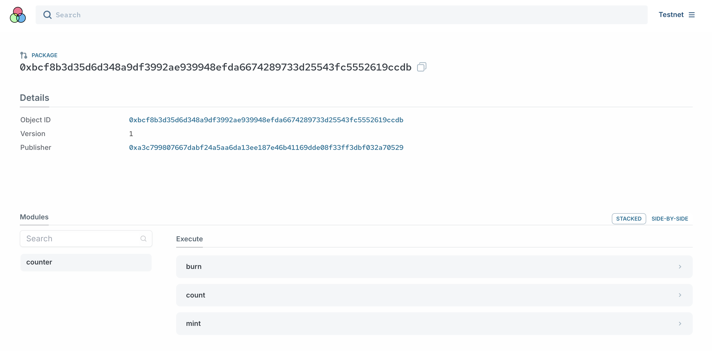

# 执行示例代码

从一份最小的计数器示例代码快速了解 Sui Move 开发。

### 安装环境

参考[指导](https://docs.sui.io/guides/developer/getting-started)，安装 Sui 的本地开发环境。
- [切换连接到测试网TestNet or DevNet](https://docs.sui.io/guides/developer/getting-started/connect), 默认指令是`sui client switch --env testnet`.
- [创建账户](https://docs.sui.io/guides/developer/getting-started/get-address), 默认指令是`sui client new-address ed25519`.
- 使用`sui client faucet`获取gas.

如果上述步骤都完成，使用 `sui client gas` 可以看到账户上的gas余额，在区块链上发布合约、进行合约交互时都需要用到gas. Sui 网络上使用的gas叫做 `SUI`, 最小单位是 `MIST`, `1 SUI = 1_000_000_000 MIST`.

命令行指令有很多，最常用的是 `sui move` 用于编译、测试代码，`sui client` 用于调用本地客户端去发布、调用、升级合约。简单浏览一下，有疑问时通过 `sui move --help` 和 `sui client --help` 查看即可。

### 部署合约

在示例代码中，包含一个最小的[计数器项目](../example_projects/counter/)。
点击进入计数器项目的目录，输入指令编译代码。

```
sui move build --skip-fetch-latest-git-deps
```
可以看到编译成功，并生成 `/build` 目录 和 `Move.lock` 文件。

*编译是一项很重要的功能，`Move` 跟 `Rust` 一样都有编译器驱动开发，在实际开发时，可以每写完一段功能，让编译器检查一下，找出代码中的问题。  
*实际开发流程是[编译、测试](https://docs.sui.io/guides/developer/first-app/build-test)、测试网发布、主网发布。本教程出于精简目的，对内容有所筛选。在测试时，[使用debug输出数值](https://docs.sui.io/guides/developer/first-app/debug)也是常用技巧。  
  
继续将合约代码发布到测试网上。
```
sui client publish --gas-budget 800000000 --skip-dependency-verification --skip-fetch-latest-git-deps
```

发布成功后会返回发布执行结果，好的开发习惯是将[发布结果](../example_projects/counter/publish-record)复制下来，保存在本地。上面会包含很多调用合约相关的信息。

在[发布结果](../example_projects/counter/publish-record)可以找到发布的合约地址 `PackageID: 0xbcf8b3d35d6d348a9df3992ae939948efda6674289733d25543fc5552619ccdb`.

使用[区块链浏览器打开合约地址](https://explorer.polymedia.app/object/0xbcf8b3d35d6d348a9df3992ae939948efda6674289733d25543fc5552619ccdb?network=testnet)，可以在这里执行合约代码。



常用的 Sui explorer 有
- [SuiVision](https://suivision.xyz/)
- [SuiScan](https://suiscan.xyz/)
- [PolyMedia](https://explorer.polymedia.app/)

### 作业
在自己本地电脑部署好 Sui 开发环境，下载[计数器项目代码](../example_projects/counter/)，使用自己的账户在测试网上发布合约，把发布结果记录保存在本地，在 explorer 上打开合约地址。
