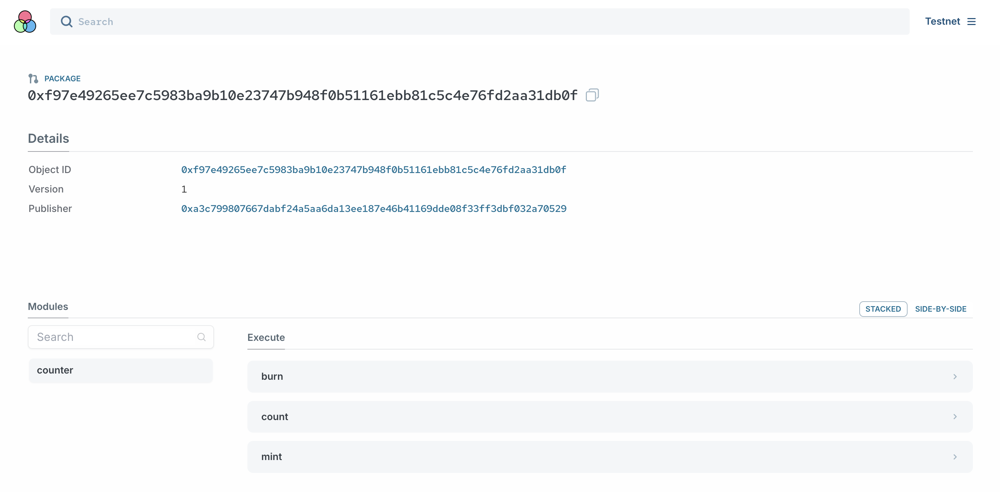

# 阅读示例代码

打开[Counter项目源代码](../example_projects/counter/sources/counter.move)，[对比](../images/explorer01.png)阅读。



### 基本布局

最基础的代码布局中

```move
module counter::counter {

}
```

第一个`counter`是`Package`, 在发布到测试网后，分配一个链上地址，得到`Package ID: 0xf97e49265ee7c5983ba9b10e23747b948f0b51161ebb81c5c4e76fd2aa31db0f`.

第二个`counter`是`Module`, 模块名，可以被自定义命名为其他名字。

在该 `module` 范围内，定义了数据结构和对应的函数。Sui Move 的编程很简单，定义数据结构，实现他们需要的函数即可。

## 定义数据结构
```move
public struct Counter has key, store {
    id: UID,
    times: u64,
}
```
`Counter`是用于计数的数据结构，除了`times`属性用于存储次数信息，还有`id`是全链上唯一的`UID`, 用于表示资源的索引。`key`和`store`都是给该数据结构定义的能力，这里先不深究，将来再一起对比学习。

具有`key`能力的数据结构也被称为`Object`, 可以直接在链上被存储和使用，常用来表示资产。`store`支持该`Object`可以被其他`Object`所有，或者说成为子数据。

## 定义函数

```move
public fun mint(recipient: address, ctx: &mut TxContext) {
    let counter = new(ctx);
    transfer::public_transfer(counter, recipient);
}

public fun count(counter: &mut Counter) {
    counter.times = counter.times + 1;
}

public fun burn(counter: Counter) {
    let Counter {
        id,
        ..
    } = counter;
    object::delete(id);
}

fun new(ctx: &mut TxContext): Counter {
    Counter {
        id: object::new(ctx),
        times: 0,
    }
}
```

### 公有函数和私有函数

定义的函数有4个，但是在[explorer上]((https://explorer.polymedia.app/object/0xf97e49265ee7c5983ba9b10e23747b948f0b51161ebb81c5c4e76fd2aa31db0f?network=testnet))只能看到3个。
`mint`, `burn`, `count` 这三个函数都是公有函数，使用了 `public fun fun_name(arg: datatype) { ... }` 的结构去声明，其中`public`是公有函数的关键词，所以这三个函数都**能直接被外部调用**。`mint`是铸造，是`create`的意思，`burn`是销毁，是`destroy`的意思，很多智能合约开发沿用这两个词去表述，只是因为以太坊时代用语的沿革。

`new`函数的声明没有`public`，就默认为私有函数，只能被这个 Package 里的函数调用，所以在 explorer 上也无法看到。

如果项目开发量大了，同一个 Package 下会包含很多个 module. 这时候可以用`public(package) fun fun_name`去定义函数，那就可以被相同 Package 内的其他 module 调用。

### 孤立原则与读写函数

`count`函数是写函数，通常还会定义读函数
```move
public fun count(counter: &mut Counter) {
    counter.times = counter.times + 1;
}

public fun times(counter: &Counter): u64 {
    counter.times
}
```
我们可以看到在该定义了`Counter`数据结构的 module 内，可以直接对其数据做读写，但离开该 module 后，只能通过该 module 里定义的公有函数去操作数据，而不能在别的 module 里定义数据的读写方法。这也被称为孤立原则。

### 引用与数据所有权

在上面几个简单的函数中，可以看到，将 `Counter` 这个 Ojbect 数据结构作为函数参数时，有三种不同的格式.
- `Counter` 值的传递
- `&Counter` 不可变引用
- `&mut Counter` 可变引用

`Counter` 的形式表示值的传递，也就是原来的所有权要被转移走，比如转移到别的账户地址；或者资源被消费，比如delete删除资源或者drop回收资源。
如果不想传递值，可以输入值的引用。在读函数中，使用不可变引用；在写函数中，使用可变引用。

### 实验
现在来做一个实验，在[合约 explorer](https://explorer.polymedia.app/object/0xf97e49265ee7c5983ba9b10e23747b948f0b51161ebb81c5c4e76fd2aa31db0f?network=testnet)中，连接钱包，调用`mint`函数两次。


第一次输入自己当前账户地址，第二次输入0x0.

两次执行完都会生成 `Counter` Object.


分别将两次生成的 `Counter` Object ID 放入 `count`函数 和 `burn`函数，看看会出现什么效果？
