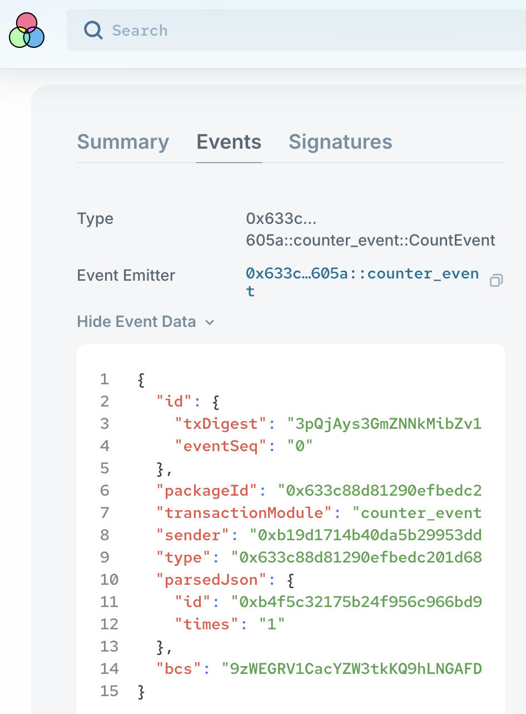

# 修改示例代码

### 实验分析
在上一节课结尾的实验结果如下：

操作 | arg0 = 自己地址 | arg0 = 0x0
--|--|--
counter | 完成计数加一 | 报错

操作 | 先counter再delete | 先delete再counter
--|--|--
结果 | 依次完成 | 执行counter时报错，显示Counter不存在
分析 | delete 之后 Object 已经不存在，无法再被调用


## Object 所有权

Sui 是以 Object 为中心的数据模型，Object 根据[所有权](https://move-book.com/object/ownership.html)可以分为四种类型。

- Account Owner 被单一账户地址所有，只有所有者才可以调用
- Shared State 被共享所有，任何地址都可以调用
- Immutable (Frozen) State 不可变类型，可以用于记录不会再发生改变的配置参数，发布后的智能合约package也属于这种类型
- Object Owner 被其他Object所有类型，用于构造更复杂的数据结构，后续用到了再学

### Account Owner 被账户地址所有

使用命令行查看`mint`出来的Object的属性
```
sui client object 0xb0e24862cf183e276cb1c1a9c92d718a67ee759aaba00d62638d22646820cc7b
```
可以看到，有很明显的`owner`属性，标明了所有权的账户地址，在被调用时，会跟发起请求的账户地址进行比对，只有一致时才会继续调用函数，否则会报错。
```
╭───────────────┬───────────────────────────────────────────────────────────────────────────────────────────────────────────────────╮
│ objectId      │  0xb0e24862cf183e276cb1c1a9c92d718a67ee759aaba00d62638d22646820cc7b                                               │
│ version       │  83977972                                                                                                         │
│ digest        │  91cHe3zzchUmxiKA1b33GzCCTaU48rcMySfk6bpY6AwK                                                                     │
│ objType       │  0xf97e49265ee7c5983ba9b10e23747b948f0b51161ebb81c5c4e76fd2aa31db0f::counter::Counter                             │
│ owner         │ ╭──────────────┬──────────────────────────────────────────────────────────────────────╮                           │
│               │ │ AddressOwner │  0x8b8c71fb95ec259a279eb8e61d52d00eb103fcd524b8fe7ff4c405c484c8a25b  │                           │
│               │ ╰──────────────┴──────────────────────────────────────────────────────────────────────╯                           │
│ prevTx        │  HZVhnXWWntcycxPfsK2Sv1ZHrdou3vnbQLgWd6X7u164                                                                     │
│ storageRebate │  1360400                                                                                                          │
│ content       │ ╭───────────────────┬───────────────────────────────────────────────────────────────────────────────────────────╮ │
│               │ │ dataType          │  moveObject                                                                               │ │
│               │ │ type              │  0xf97e49265ee7c5983ba9b10e23747b948f0b51161ebb81c5c4e76fd2aa31db0f::counter::Counter     │ │
│               │ │ hasPublicTransfer │  true                                                                                     │ │
│               │ │ fields            │ ╭───────┬───────────────────────────────────────────────────────────────────────────────╮ │ │
│               │ │                   │ │ id    │ ╭────┬──────────────────────────────────────────────────────────────────────╮ │ │ │
│               │ │                   │ │       │ │ id │  0xb0e24862cf183e276cb1c1a9c92d718a67ee759aaba00d62638d22646820cc7b  │ │ │ │
│               │ │                   │ │       │ ╰────┴──────────────────────────────────────────────────────────────────────╯ │ │ │
│               │ │                   │ │ times │  0                                                                            │ │ │
│               │ │                   │ ╰───────┴───────────────────────────────────────────────────────────────────────────────╯ │ │
│               │ ╰───────────────────┴───────────────────────────────────────────────────────────────────────────────────────────╯ │
╰───────────────┴───────────────────────────────────────────────────────────────────────────────────────────────────────────────────╯
```

### Shared State 共享所有权
在业务中也有很多需要被任何人都可以调用的数据，比如 Market 需要允许不同用户寄存资产进行交易。
如果我们把上一小节代码中的 `Counter` 变为一个任何人都可以调用的计数器，只需要将 `mint`函数改为：
```rust
public fun mint(ctx: &mut TxContext) {
    let counter = new(ctx);
    transfer::public_share_object(counter);
}
```

`public_share_object` 函数是将生成的 `counter` Object 变为共享所有权的状态，这样生成的计数器 `Counter`可以被任何账户地址调用。

### Fast Path & Consensus 执行效率
不同的Object所有权会对程序的执行效率有影响。
如果一个Object数据正在被多个人读写，就需要排序、锁定。Shared State 被共享所有的数据需要做这样的处理。
如果Object数据只属于个人账户，就只会被个人操作，不需要做排序和锁定，可以更快确认状态，也叫 Fast Path.
至于被其他Object所有的Object, 按照最上级Object的类型去处理。
Sui Move 智能合约在执行时，会根据函数输入参数的类型，先做分类，选择不同的执行效率。在设计合约时，可以结合需求选择更优方案。

### 作业一
改写[counter](../example_projects/counter/sources/counter.move)项目代码，生成共享所有权的`Counter`, 然后换用不同账户地址去调用计数。

## Event

就像服务器会输出记录执行日志一样，Sui 区块链也会把智能合约执行结果输出成 Event, 方便检索。不过需要在合约里自己定义。

[这](../example_projects/counter_event/sources/counter_event.move)是一份在原有的 counter 项目中[添加 Event 功能的示例代码](../example_projects/counter_event/sources/counter_event.move)。

以下是一些修改的关键要点。

1. 在 module 内引入 event 模块。

```rust
use sui::event::emit;
```

2. 定义 Event 数据结构。

```rust
public struct CountEvent has copy, drop {
    id: ID,
    times: u64,
}
```
这是定义了`copy`, `drop`能力的数据结构。

3. 在原有函数内添加 emit event 功能。

```rust
public fun count(counter: &mut Counter) {
    counter.times = counter.times + 1;

    emit(
        CountEvent {
            id: object::id(counter),
            times: counter.times,
        }
    );
}
```
添加了这些 Event 功能后，再执行，就可以在 explorer 上看到 Event 记录。



### 作业二

在 [counter_event](../example_projects/counter_event/sources/counter_event.move) 示例代码中，为 `mint`, `burn` 也分别添加 Event 功能。

## Ability 能力

截至目前，我们已经遇到了 Sui Move 上所有的 Struct 能力，一共4个。
