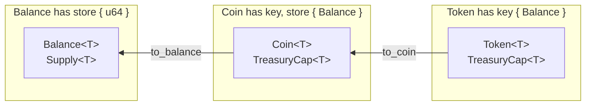
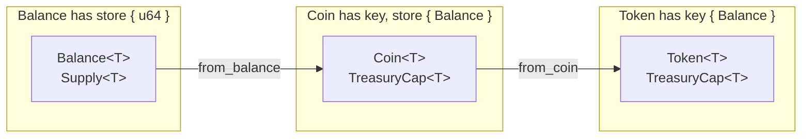

# 应用内token

很多应用都会存在内置代币，用于应用内消费使用场景。如果使用[通用的Coin代币标准](https://docs.sui.io/standards/coin)，有可能会被用户无许可添加到交易所流通，也会造成困扰。一个非常值得被了解的技术方案是[Token标准](https://docs.sui.io/standards/closed-loop-token)。Token可以被限定在应用内的使用方式，比如是否可以被转移、被消费、以及将来可否被转换成Coin, 非常适合作为应用内代币。

## Token 基础概念

`Token`, `Coin`, `Balance`的数据结构可以互相转换。



`Coin`的数据结构在定义时包含`key`和`store`能力，在上一节课程中属于可以随意被转移和交易的Object, 而`Token`的数据结构定义只包含`key`能力，因此不能随意被转移，可以被限定使用场景。

```rust
// defined in `sui::coin`
struct Coin<phantom T> has key, store { id: UID, balance: Balance<T> }

// defined in `sui::token`
struct Token<phantom T> has key { id: UID, balance: Balance<T> }
```

在`Token`中，有四种操作是被限定的：
- `token::transfer` - 将`Token`转移到其他地址
- `token::to_coin` - 将`Token`转变为`Coin`
- `token::from_coin` - 将`Coin`转变为`Token`
- `token::spend` - 将`Token`消费掉
  
这四种操作的函数，都会产生`ActionRequest<T>`的数据结构，比如看`token::spend`函数的定义。
`public fun spend<T>(t: Token<T>, ctx: &mut TxContext): ActionRequest<T>`  
其中，`ActionRequest<T>`是属于[Hot Potato模式](https://move-book.com/programmability/hot-potato-pattern.html)的数据结构，必须要被后续的函数分解，否则会阻塞函数运行并回退。

在[`token`模块](https://github.com/MystenLabs/sui/blob/main/crates/sui-framework/packages/sui-framework/sources/token.move)中，提供了`TreasuryCap`, `TokenPolicy` 和 `TokenPolicyCap` 三个Object以及对应的函数方法去分解`ActionRequest<T>`.

它们的使用方法有很多，支持了很多灵活的自定义方式。本小节教程提供一个简单的[代码示例](../example_projects/app_token/sources)。

## 示例讲解
