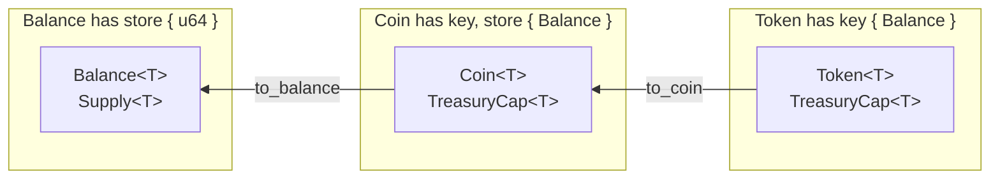
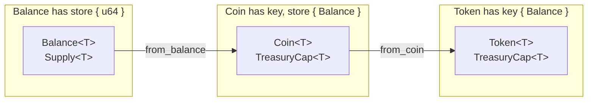

# 应用内token

很多应用都会存在内置代币，用于应用内消费使用场景。如果使用[通用的Coin代币标准](https://docs.sui.io/standards/coin)，有可能会被用户无许可添加到交易所流通，也会造成困扰。一个非常值得被了解的技术方案是[Token标准](https://docs.sui.io/standards/closed-loop-token)。Token可以被限定在应用内的使用方式，比如是否可以被转移、被消费、以及将来可否被转换成Coin, 非常适合作为应用内代币。

## Token 基础概念

`Token`, `Coin`, `Balance`的数据结构可以互相转换。



`Coin`的数据结构在定义时包含`key`和`store`能力，在上一节课程中属于可以随意被转移和交易的Object, 而`Token`的数据结构定义只包含`key`能力，因此不能随意被转移，可以被限定使用场景。

```rust
// defined in `sui::coin`
struct Coin<phantom T> has key, store { id: UID, balance: Balance<T> }

// defined in `sui::token`
struct Token<phantom T> has key { id: UID, balance: Balance<T> }
```

在`Token`中，有四种操作是被限定的：
- `token::transfer` - 将`Token`转移到其他地址
- `token::to_coin` - 将`Token`转变为`Coin`
- `token::from_coin` - 将`Coin`转变为`Token`
- `token::spend` - 将`Token`消费掉
  
这四种操作的函数，都会产生`ActionRequest<T>`的数据结构，比如看`token::spend`函数的定义。
`public fun spend<T>(t: Token<T>, ctx: &mut TxContext): ActionRequest<T>`  
其中，`ActionRequest<T>`是属于[Hot Potato模式](https://move-book.com/programmability/hot-potato-pattern.html)的数据结构，必须要被后续的函数分解，否则会阻塞函数运行并回退。

在[`token`模块](https://github.com/MystenLabs/sui/blob/main/crates/sui-framework/packages/sui-framework/sources/token.move)中，提供了`TreasuryCap`, `TokenPolicy` 和 `TokenPolicyCap` 三个Object以及对应的函数方法去分解`ActionRequest<T>`.

它们的使用方法有很多，支持了很多灵活的自定义方式。本小节教程提供一个简单的[代码示例](../example_projects/app_token/sources)。

## 示例讲解

完整代码在[这里](../example_projects/app_token/sources)。

### 引入模块
当我们的项目工程变得复杂时，需要将代码分在不同模块。这个示例代码是本系列课程第一次出现的分模块代码。`/sources`目录下，将代码分为了两个模块。

```
sources
├── app_token.move
├── profile.move
```
其中，`profile.move`使用的是之前的示例代码，包含创建`Profile`和每个epoch打卡一次的功能，需要在`app_token.move`模块内被用到。
那么，在`app_token.move`模块内引用`Profile.move`的方法是，使用`use`声明。
```
use app_token::profile::{Self, Profile};
```
表示引入了`app_token`package下的`profile`module的`Self`和`Profile`数据结构，其中`Self`表示整个`profile`模块。后续使用`profile`模块的`click`函数时，用`profile::click(arg, ctx);`的格式去调用。

要使用`token`功能，还需要从sui标准库中引入一些相关模块。

```rust
use sui::{
    coin::{Self, TreasuryCap},
    token::{Self, TokenPolicy, Token}
};
```

### 初始化

```rust
const DECIMALS: u8 = 0;
const SYMBOLS: vector<u8> = b"APP";
const NAME: vector<u8> = b"App";
const DESCRIPTION: vector<u8> = b"Token for Application";
const ICON_URL: vector<u8> = b"https://";  // Coin / Token Icon

public struct APP has drop {}

public struct AdminCap has key, store {
    id: UID,
}

public struct AppTokenCap has key {
    id: UID,
    cap: TreasuryCap<APP>,
}

fun init(otw: APP, ctx: &mut TxContext) {
    let deployer = ctx.sender();
    let admin_cap = AdminCap { id: object::new(ctx) };
    transfer::public_transfer(admin_cap, deployer);

    let (treasury_cap, metadata) = coin::create_currency<APP>(
        otw,
        DECIMALS,
        SYMBOLS, 
        NAME, 
        DESCRIPTION, 
        option::some(new_unsafe_from_bytes(ICON_URL)), 
        ctx
    );

    let (mut policy, cap) = token::new_policy<APP>(
        &treasury_cap, ctx
    );

    let token_cap = AppTokenCap {
        id: object::new(ctx),
        cap: treasury_cap,
    };

    token::allow(&mut policy, &cap, token::spend_action(), ctx);
    token::share_policy<APP>(policy);
    transfer::share_object(token_cap);
    transfer::public_transfer(cap, deployer);
    transfer::public_freeze_object(metadata);
}
```

`TreasuryCap`来自`sui::coin`模块，直接使用`coin::create_currency<T>`方法创建。返回的metadata是记录代币图标、Tick等信息的数据，如果不再改动可以冻结起来。

```rust
let (treasury_cap, metadata) = coin::create_currency<APP>(
    otw,
    DECIMALS,
    SYMBOLS, 
    NAME, 
    DESCRIPTION, 
    option::some(new_unsafe_from_bytes(ICON_URL)), 
    ctx
);

transfer::public_freeze_object(metadata);
```

在示例代码中，提供了获取和消费`token`的两种场景。

先使用`TreasuryCap`来创建`TokenPolicy`和`TokenPolicyCap`, 添加支持消费`spend`的许可。然后共享`TokenPolicy`, 把`TokenPolicyCap`发送给部署合约地址。

```rust
let (mut policy, cap) = token::new_policy<APP>(
    &treasury_cap, ctx
);

token::allow(&mut policy, &cap, token::spend_action(), ctx);
token::share_policy<APP>(policy);
transfer::public_transfer(cap, deployer);
```

定义一个`AppTokenCap`结构，将`TreasuryCap`封装起来，这是避免任何人都能直接使用`TreasuryCap`去执行任意操作，只能按照本模块合约内定义的函数方法去调用。最后将`AppTokenCap`共享。

```rust
public struct AppTokenCap has key {
    id: UID,
    cap: TreasuryCap<APP>,
}

let token_cap = AppTokenCap {
    id: object::new(ctx),
    cap: treasury_cap,
};

transfer::share_object(token_cap);
```

定义一个管理员权限`AdminCap`, 并且定义一个可以通过`AdminCap`, 从`AppTokenCap`中获取`TreasuryCap`可变引用的函数。因为，将来如果需要定期将被消费过的`Token`清除，还需要通过`&mut TreasuryCap`调用`token::flush`函数。

```rust
public struct AdminCap has key, store {
    id: UID,
}

public fun treasury_borrow_mut(
    _admin: &AdminCap,
    app_token_cap: &mut AppTokenCap,
): &mut TreasuryCap<APP> {
    &mut app_token_cap.cap
}
```

### 获得token

这是获得`token`的函数实现`click2earn`.
```rust
public fun click2earn(
    profile: &mut Profile,
    token_cap: &mut AppTokenCap,
    ctx: &mut TxContext
) {
    profile::click(profile, ctx);
    let app_token: Token<APP> = token::mint(&mut token_cap.cap, profile::points(profile), ctx);
    emit(Click2EarnEvent {
        user: ctx.sender(),
        amount: token::value<APP>(&app_token),
    });
    let req: ActionRequest<APP> = token::transfer<APP>(app_token, ctx.sender(), ctx);
    token::confirm_with_treasury_cap<APP>(
        &mut token_cap.cap,
        req,
        ctx
    );
}
```

先要成功执行`profile::click(profile, ctx);`函数，接着使用`token::mint`方法创建了`app_token: Token<APP>`. `app_token`是变量名，`Token<APP>`是数据格式。  
当使用`token::transfer`方法将`app_token: Token<APP>`转移给用户地址时，会产生`req: ActionRequest<APP>`.   
最后使用`token::confirm_with_treasury_cap`将`req: ActionRequest<APP>`分解，函数就会成功执行。调用`req: ActionRequest<APP>`的第一个变量是`&mut TreasuryCap<APP>`, 可以输入`&mut token_cap.cap`, 表示`AppTokenCap`的`cap`属性，也就是被封装在`AppTokenCap`里的`TreasuryCap<APP>`.

### 消费token

这是消费`token`的函数实现`buy`.

```rust
public fun buy(
    payment: Token<APP>,
    price_record: &PriceRecord,
    purchased_record: &mut PurchasedRecord,
    item: String,
    token_prolicy: &mut TokenPolicy<APP>,
    ctx: &mut TxContext
) {
    let price = &price_record.prices[item];
    assert!(token::value<APP>(&payment) == *price, EWrongAmount);
    let req = token::spend(payment, ctx);
    token::confirm_request_mut(token_prolicy, req, ctx);
    table::add<String, bool>(&mut purchased_record.record, item, true);
    emit(BuyEvent {
        buyer: ctx.sender(),
        item,
        price: *price,
    });
}
```

输入参数说明：
- `payment: Token<APP>` - 要被消费的`Token<APP>`
- `price_record: &PriceRecord` - 记录所有商品价格的数据，是Shared Object
- `purchased_record: &mut PurchasedRecord` - 每个用户独有的记录已购买产品信息的Object
- `item: String` - 购买的项目的名称，String类型
- `token_prolicy: &mut TokenPolicy<APP>` - 之前在初始化时被共享的`TokenPolicy`, 已经添加了`spend`许可

获取商品的价格并与传入`Token<APP>`的面值对比，如果不一致会报错。
```rust
let price = &price_record.prices[item];
assert!(token::value<APP>(&payment) == *price, EWrongAmount);
```

```rust
let req: ActionRequest<APP> = token::spend(payment, ctx);
token::confirm_request_mut(token_prolicy, req, ctx);
```

使用`token::spend`方法消费`Token<APP>`会产生包含`spend`和数量信息的`req: ActionRequest<APP>`.  
由于`token_prolicy: &mut TokenPolicy<APP>`在初始化函数里已经被添加了`spend`许可，在这里可以用`token::confirm_request_mut`方法将`ActionRequest<APP>`分解掉。

最后，在`PurchasedRecord`中添加购买记录。如果之前已经购买过，`table`会阻止重复添加相同的`Key`, 就会阻止函数执行并且回退。

```rust
table::add<String, bool>(&mut purchased_record.record, item, true);
```

### 其他功能

#### 申领 PurchasedRecord

```rust
public fun get_purchased_record(ctx: &mut TxContext) {
    let record = PurchasedRecord {
        id: object::new(ctx),
        record: table::new<String, bool>(ctx),
    };
    transfer::transfer(record, ctx.sender());
}
```

#### 管理员设置或删除商品价格

```rust
public fun set_item_price(
    _admin: &AdminCap,
    price_record: &mut PriceRecord,
    item: String,
    price: u64,
) {
    if (table::contains<String, u64>(&price_record.prices, item)) {
        let item_price = &mut price_record.prices[item];
        *item_price = price;
    } else {
        table::add<String, u64>(&mut price_record.prices, item, price);
    };
}

public fun remove_item_price(
    _admin: &AdminCap,
    price_record: &mut PriceRecord,
    item: String,
) {
    table::remove<String, u64>(&mut price_record.prices, item);
}
```

### 作业
阅读[`Token`标准](https://docs.sui.io/standards/closed-loop-token)与[`sui::token`源代码](https://github.com/MystenLabs/sui/blob/main/crates/sui-framework/packages/sui-framework/sources/token.move)。  
在本小节示例代码的基础上，新建一个可以支持`token::to_coin`的`TokenPolicy`, 当`Profile`的点数到达100时，可以支持将所有持有的`Token<APP>`转为`Coin<APP>`, 并且每次转换，都会将`Profile`的点数清零。  
`app_token.move`和`profile.move`模块都需要添加新代码，支持`token::to_coin`的`TokenPolicy`需要被封装起来。